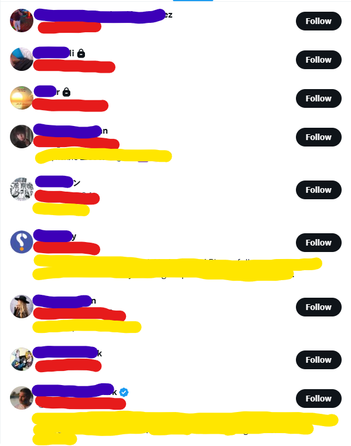
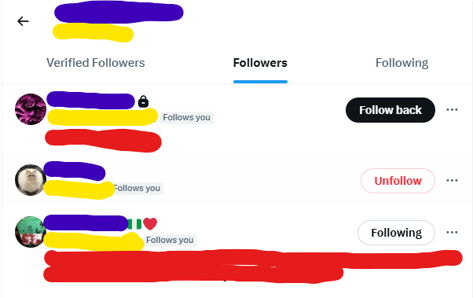

# TwitterBot3

Playwright-driven X/Twitter bot with a persistent browser profile.

## Setup

```bash
poetry install
poetry run playwright install chromium
```

## One-time login

```bash
poetry run python src/main.py login
```

A headful Chromium opens to x.com/login. Sign in (with 2FA if needed), then close the window. The session is now persisted in `data/browser_profile/`.

## Commands

```bash
# List followers of a user (prints profile URLs; skips private accounts)
poetry run python src/main.py followers <username>

# List who a user follows
poetry run python src/main.py following <username>

# Follow a user by profile URL
poetry run python src/main.py follow https://x.com/<username>

# Unfollow a user by profile URL
poetry run python src/main.py unfollow https://x.com/<username>
```

The `followers` / `following` commands scrape the same virtualized list X
shows in the browser — scrolling until no new rows appear:



Add `--debug` to dump HTML + screenshots into `data/debug/`.
Add `--headful` to watch it work.

## Churn flow

The main automation loop. Idempotent — re-reads `data/actions.log` on every
run, so duplicate follows are skipped and rate limits self-enforce.

```bash
# Dry-run first to see what it would do without touching anything
poetry run python src/main.py churn --dry-run

# For real
poetry run python src/main.py churn
```

What it does, in order:

1. Reads `data/actions.log` and checks hour/day follow caps. If either is
   already met, exits immediately.
2. **Unfollow phase** — anyone successfully followed more than
   `MAX_FOLLOW_AGE_DAYS` ago (and not yet unfollowed) gets unfollowed, up to
   `MAX_UNFOLLOWS_PER_RUN`.
3. **Discovery phase** — pulls the top `SEED_FOLLOWERS_TOP_X` of your
   followers, then for each of them pulls the top `PER_SEED_FOLLOWERS_TOP_Y`
   of *their* followers (2 layers deep). Filters out anyone already touched
   in the log and any private accounts.

   
4. Follows up to `FOLLOWS_PER_RUN_Z` of those candidates, sleeping
   `SECONDS_BETWEEN_FOLLOWS` between clicks, stopping early if it would
   exceed the hour/day caps.

All follow/unfollow attempts are appended as JSON lines to
`data/actions.log`.

### Config

All tunables live in **`src/config.py`** — edit that file to change your
handle, rate limits, follow age, batch sizes, and pacing. Defaults are
conservative.

Safe to run on a cron (e.g. hourly) since the log makes it idempotent.
